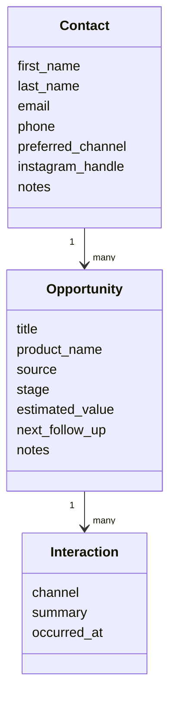

<h1>
  <span class="headline">Atelier CRM</span>
  <span class="subhead">Project Overview and CRM Planning</span>
</h1>

**Learning objective:** By the end of this lesson, students will be able to explain the CRM workflow and plan relational data for a sales application.

## What are we building?

A CRM helps a business remember who its customers are, what they may purchase, and what should happen next.

Our fictional business sells premium leather goods and custom office furniture. A customer may contact the business through Instagram, WhatsApp, a website, a referral, or a physical store.

The CRM will help staff answer questions such as:

- Who is this customer?
- What product are they considering?
- How valuable might the sale be?
- What stage is the sale in?
- When should someone follow up?
- What has already been discussed?

## The required user journey

```text
Staff logs in
    ↓
Staff creates or finds a contact
    ↓
Staff creates an opportunity for that contact
    ↓
Staff records messages, calls, or meetings
    ↓
Staff updates the opportunity stage
    ↓
The dashboard shows what needs attention
```

## User stories

A staff member should be able to:

- Create, view, edit, and delete contacts
- Create an opportunity belonging to a contact
- View opportunities grouped by sales stage
- Move an opportunity to another stage
- Record an interaction with the customer
- See upcoming follow-ups and pipeline totals
- Log in before accessing business data

## What is not part of the MVP?

We will not build:

- Public customer registration
- Inventory or point-of-sale synchronization
- Direct Instagram message imports
- Direct WhatsApp message imports
- Invoicing or payments
- Multiple client companies in the same database
- Drag-and-drop pipeline cards
- Custom fields created by users

These features are possible, but they each introduce a separate set of security, product, and infrastructure decisions.

## Our data model



### Why is Contact-to-Opportunity one-to-many?

One customer may be interested in several products over time. Each opportunity belongs to one contact, but one contact may own many opportunities.

### Why is Opportunity-to-Interaction one-to-many?

A possible sale usually involves several messages, calls, or meetings. Each interaction belongs to one opportunity.

## Sales stages

We will use one fixed pipeline:

```text
New → Contacted → Qualified → Proposal → Won / Lost
```

- **New:** The inquiry was just recorded.
- **Contacted:** A staff member has responded.
- **Qualified:** The customer has a realistic need, interest, and budget.
- **Proposal:** The business has sent a quote or recommendation.
- **Won:** The sale was completed.
- **Lost:** The customer did not continue.

## Why start with workflow instead of a dashboard?

A dashboard is only useful when the application contains meaningful data. We will first build the records and actions that create that data. The dashboard will be a summary of actual contacts and opportunities rather than a collection of hard-coded cards.

## Check for understanding

1. Is a contact the same as a sale?
2. Why should an interaction belong to an opportunity?
3. Which model should store a follow-up date?
4. What is one feature we are intentionally leaving out?

## You do

Choose another premium product business. Write one example contact, opportunity, and interaction that could exist in its CRM.
